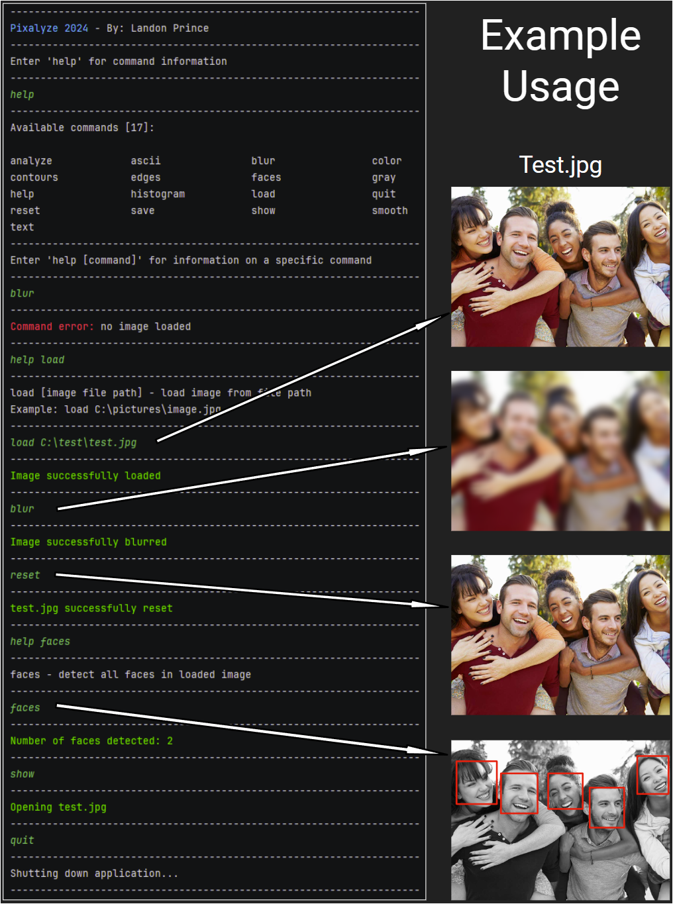

# Pixalyze 
> Real-time image analysis & processing application


## Description
Pixalyze is an easy-to-use command-line application. It allows for the use of an evergrowing collection of commands to analyze and process images.
This application primarily utilizes the OpenCV library to rapidly parse and manipulate images in real-time. 

## Tools 
- __OS:__ Windows 11 64-bit
- __IDE:__ CLion 2024.1.1
- __Compiler:__ Visual Studios 2022 17.0
- __Build Tool:__ CMake 2.28.1
- __Library Manager:__ Chocolatey 2.2.2
- __Libraries:__ OpenCV 4.9.0

## Installation
- ### Clone repository & run application
  - Run Powershell and run the following commands:
  - ```
    git clone https://github.com/yourusername/your-repo-name.git
    cd your-repo-name/cmake-build-debug
    ./pixalyze
## Usage

## Command Structure

